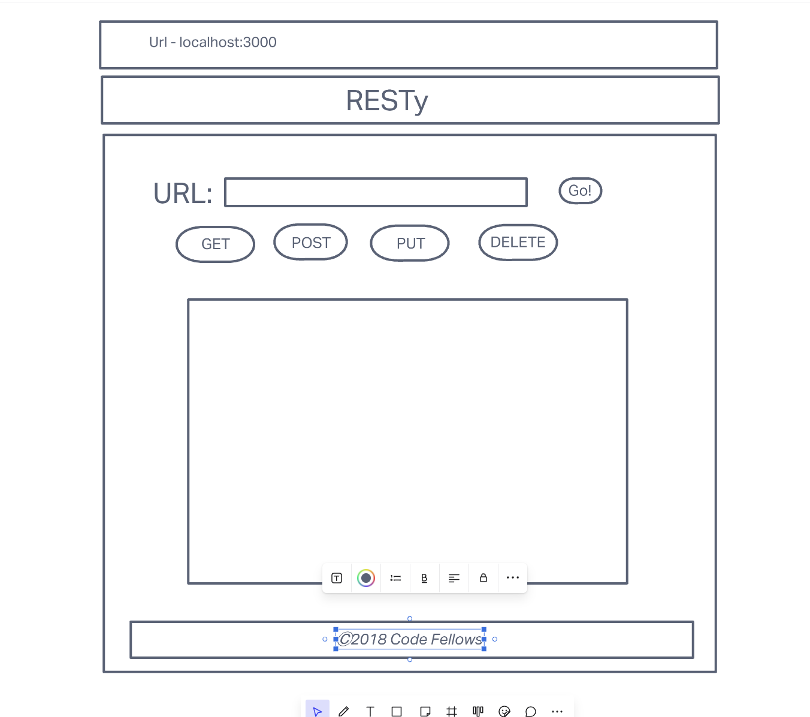

# Resty

Project by:  Andres Mills Gallego

## Lab 26

This is the first part in a 4 part lab series which will build out the RESTy React application

To start things off we imported some [starter code]() into our new repo. 
From there we refactored the existing code to make all components functional components (with the exception of the app.js component)
Then we began to work with Sass to style our app. 

## Lab 27

For this part of the project we will be working with user input and the `useState()` hook in our functional components. 

### User Stories

- As a user, I want to enter the REST Method and URL to an API
- As a user, I want to see a summary of my request as well as results returned from an API request in my browser in a readable format

### Application Flow

- User enters an API URL
- Chooses a REST Method
- Clicks the “Go” button
- Application fetches data from the URL given, with the method specified
- Displays the response headers and results separately
- Both headers and results should be “pretty printed” JSON

